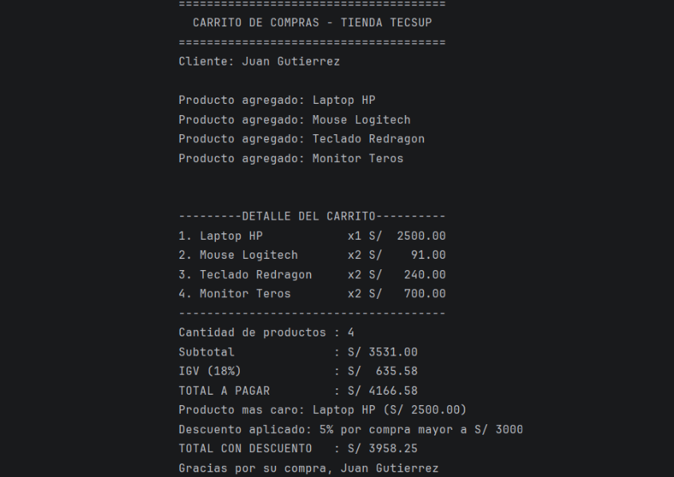

# Kotlin
### Estudiante: Gutierrez Duran, Juan Diego
### Programa
* El programa simula un carrito de compras para la Tienda Tecsup. Su objetivo es
registrar los artículos y imprimir una boleta ordenada en consola, calcular el IGV - 18% y aplicar un descuento automático dependiendo del monto final de la compra.

| Función                                  |                                                        Descripción                                                        |
|------------------------------------------|:-------------------------------------------------------------------------------------------------------------------------:|
| Producto (data class)                    |              Sirve como plantilla para guardar la información de cada Producto (nombre, precio y cantidad).               |
| calcularSubtotal()                       |  Recorre el carrito, multiplica el precio de cada ítem por su cantidad y suma todo para obtener el total sin impuestos.   |
| calcularIGV()                            |                                  Retorna el 18% de impuesto correspondiente al subtotal.                                  |
| calcularTotal()                          |                       Suma el subtotal con el IGV para obtener el precio total antes de descuentos.                       |
| mostrarDetalle()                         |            Imprime en la consola la lista de productos agregados con sus respectivos montos en forma de recibo            |
| mensajeDescuento() y calcularDescuento() | Evalúan el monto total; si la compra supera los S/ 3,000 aplica un 5% de rebaja, y si supera los S/ 5,000 aplica un 10%.  |
 

### Analiza y Responde

* ¿por qué nombre y precio son val pero cantidad es var? ¿Qué
  pasaría si intentas cambiar el precio después de crear el producto?

**El nombre y el precio se definen con val ya que durante la aplicación no se les reasignara un valor nuevo, por otro lado
la cantidad es definida con var ya que su valor puede cambiar las veces necesarias al ejecutar la aplicación. Si se intenta
cambiar el precio después de crear el producto este mismo el compilador generará un error como este: "Val cannot be reassigned"
(val no puede ser reasignado) y el código no se compila.**

### Resultado

