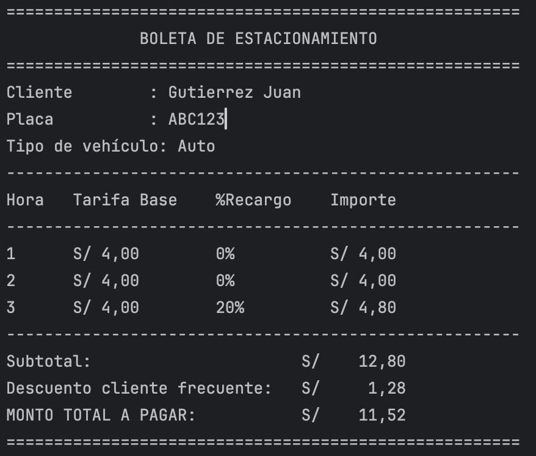
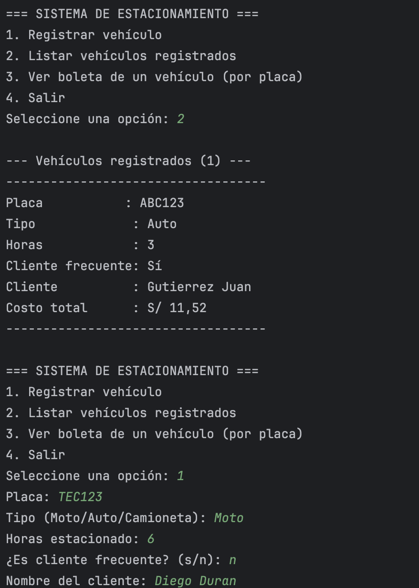
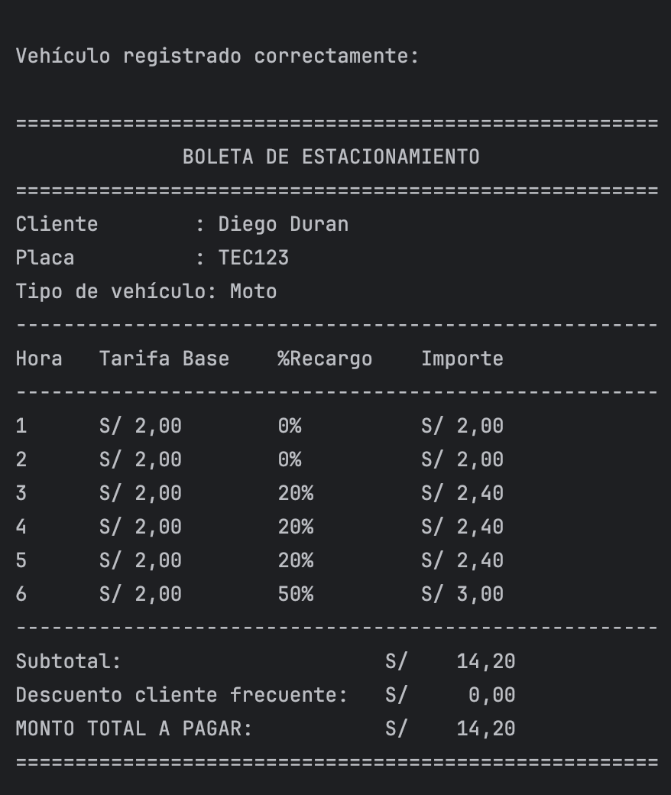

##### PROMPTS UTILIZADOS:
###### Prompt 1: 
* Crea la clase Vehículo en Kotlin para un sistema de estacionamiento. La clase debe manejar solo tres tipos de vehículos: Moto, Auto y Camioneta.
  * Implementa los atributos:
    * placa (String)
    * tipo (String: Moto, Auto, Camioneta)
    * horas (Entero, con validación para que no sea menor a 1)
    * es_cliente_frecuente(Booleano)
    * nombre_cliente (String)
  * Incluye el constructor que evite un registro con menos de 1 hora. Todo esto es una aplicación de terminal, no uses interfaces gráficas.

###### Prompt 2:
* Extiende la clase Vehículo agregando la lógica de negocio para calcular el costo total del estacionamiento según estas reglas:
  * Tarifas base por hora:
    * Moto: S/ 2.00
    * Auto: S/ 4.00
    * Camioneta: S/ 10.00
  * Tarifas por horas:
    * 1-2 Horas: 0% de recargo sobre la tarifa base.
    * 3-5 Horas: 20% de recargo sobre la tarifa base de cada una de esas horas.
    * 6ta Hora en adelante: 50% de recargo sobre la tarifa base de cada hora adicional.
    * Descuento por Frecuencia:
  * Si es_cliente_frecuente es true, aplica un 10% de descuento sobre el monto total final.
  * Implementa el método calcular_total() detallando el monto por cada hora transcurrida.Todo esto es una aplicación de terminal, no uses interfaces gráficas.

###### Prompt 3:
* Implementa un método generar_boleta() en la clase Vehículo que imprima en consola un comprobante detallado con el siguiente formato:
  * Datos: Nombre del cliente, placa y tipo de vehículo.
  * Tabla de Tarifa por hora: Muestra la columna Hora, Tarifa Base, %Recargo e Importe por hora.
  * Resumen de pago: Subtotal, descuento aplicado y Monto Total a pagar.
* Todo esto es una aplicación de terminal, no uses interfaces gráficas.

