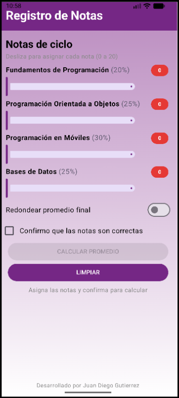
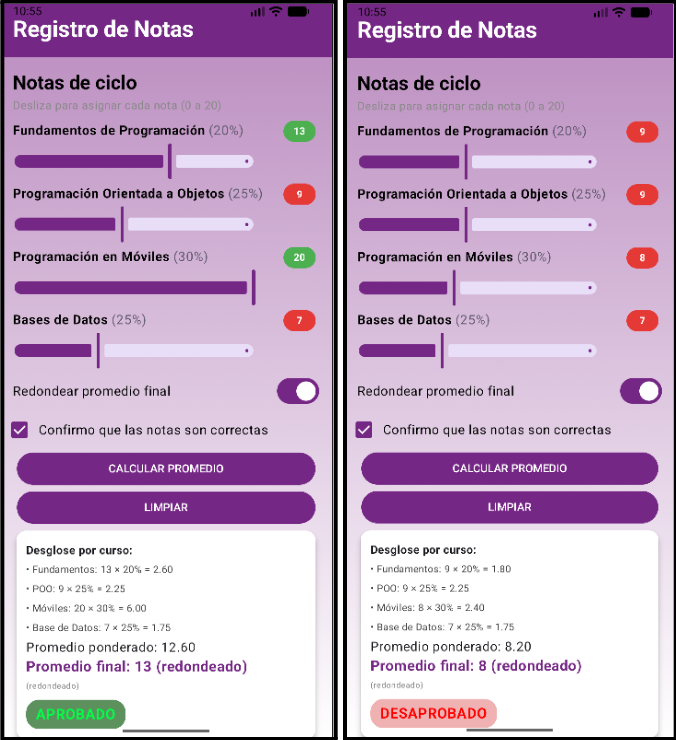
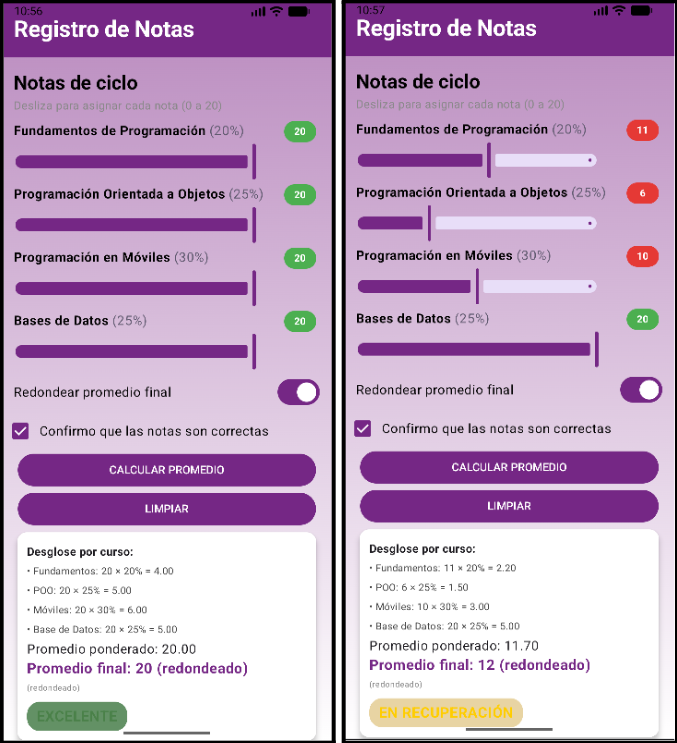

# Registro de Notas App

Aplicación móvil nativa en Android desarrollada con Jetpack Compose y Material3 para calcular el promedio ponderado de notas académicas.

---
## Funcionalidades

* **Sliders interactivos**: Selección de notas (0 a 20) con actualización del valor en vivo.
* **Cálculo ponderado**: Pesos por asignatura (20%, 25%, 30% y 25%).
* **Modo redondeo**: Switch para alternar entre promedio exacto y entero más cercano.
* **Estado dinámico**: Tarjeta de resultados con estado condicional (Excelente, Aprobado, En recuperación, Desaprobado).
* **Desglose de aportes**: Vista del aporte individual de cada curso (Nota \times Peso).
* **Badges con semáforo**: Cambian a verde (>=13) o rojo (< 13) según la nota.
* **Botón Limpiar**: Reinicia el formulario y oculta los resultados.

---
## Resultados

###### Vista Inicial

###### Pruebas

######

**Desarrollado por Juan Diego Gilmer Gutierrez Duran**