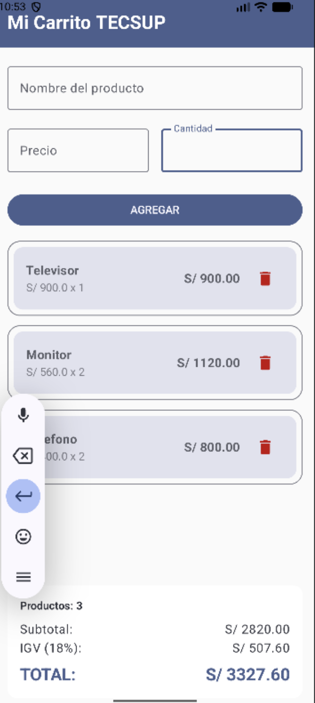

# LABORATORIO 04
###### Estudiante: Gutierrez Duran Juan Diego Gilmer
---
**¿Por qué la lista se declara con val y aún así podemos agregarle elementos?**

La lista se declara con val para asegurarse que la referencia de la variable sea inmutable, pero esto no afecta la mutabilidad del objeto en sí. 
Como la lista es de tipo MuteableList si se puede modificar lo que contiene.

**¿Por qué mutableStateListOf y no una MutableList normal?**

mutableStateListOf crea una lista observable por el motor de Jetpack Compose. Al agregar o eliminar elementos, la lista notifica automáticamente al 
sistema para que llame a la recomposición de la interfaz y la pantalla se actualice en tiempo real. Una MutableList altera los datos 
internamente, pero no notifica a la UI por ello la pantalla no mostraría los cambios.

**¿Qué hace weight(1f) en la LazyColumn?**

El modificador weight(1f) indica al contenedor Column, que la LazyColumn debe expandirse y tomar todo el espacio vertical disponible sobrante.

---
### Resultados

