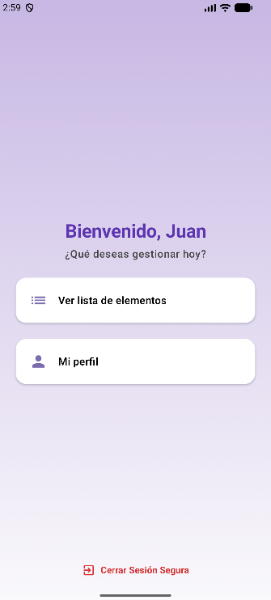
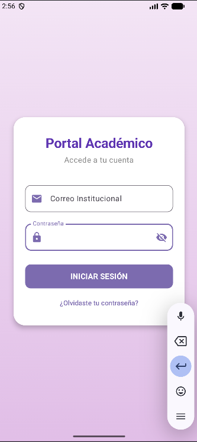
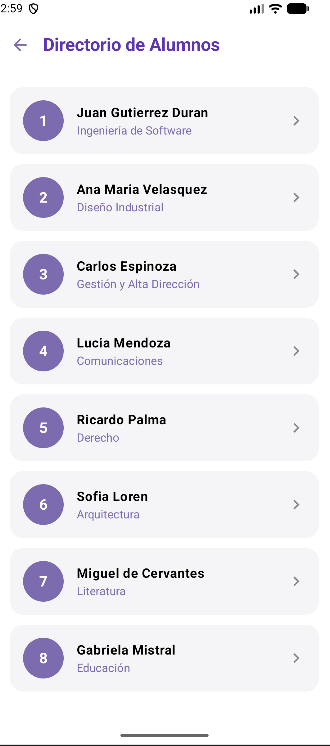
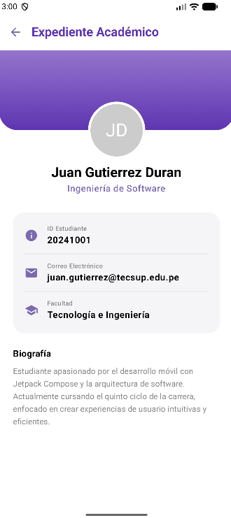
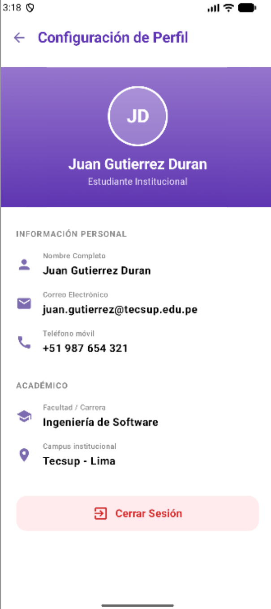

# Laboratorio 5: Navegación con Jetpack Compose
###### Gutierrez Duran Juan Diego Gilmer - C24D
---

### Requerimientos Funcionales
* RF-01: El sistema debe permitir navegar entre pantallas (Home, Lista, Detalle, Perfil) usando Jetpack Navigation Compose.
* RF-02: El sistema debe mostrar una lista de elementos y permitir seleccionar uno para ver su detalle.
* RF-03: El sistema debe pasar el ID del elemento seleccionado como argumento tipado (Int) hacia la pantalla de detalle.
* RF-04: El sistema debe permitir regresar a la pantalla anterior (botón atrás) y volver al inicio limpiando el historial de navegación.

---
### Prompt Utilizado.
Eres un diseñador UI/UX experto en aplicaciones Android con Material Design 3. Voy a mostrarte una app académica simple hecha con Jetpack Compose que actualmente tiene un diseño básico (texto plano, botones sin estilo, fondo blanco). Necesito que generes mockups de alta fidelidad para las siguientes 5 pantallas, manteniendo exactamente la misma funcionalidad y flujo de navegación, pero con una presentación visual profesional, moderna y con buen contraste.

Paleta de colores (aplica a todas las pantallas): usa un morado suave tipo
#7C6BAF u
#8875B8 para elementos sólidos (botones, títulos). Para los paneles/cabeceras que llevan foto de perfil, usa un degradado de dos tonos morados: morado medio (
#9575CD) a morado oscuro (
#5E35B1). Evita tonos demasiado oscuros o saturados en fondos grandes de pantalla completa.

1. Pantalla de Login ("Portal Académico"): tarjeta centrada con esquinas redondeadas sobre fondo degradado lila suave, título "Portal Académico" en morado oscuro bold, subtítulo "Accede a tu cuenta", campo "Correo Institucional" con ícono de sobre, campo "Contraseña" con ícono de candado y, al final del campo, un ícono estándar de Material Design de "ojo" (visibility/visibility-off) para mostrar/ocultar la contraseña — no uses emoji, debe ser el ícono de ojo típico de Material Icons, del mismo tono morado que los demás íconos. Botón sólido morado suave "INICIAR SESIÓN" de ancho completo con esquinas redondeadas, y enlace "¿Olvidaste tu contraseña?" debajo.
2. Pantalla de Bienvenida (Home): fondo con degradado morado suave y claro, morado medio en la parte superior aclarándose hacia abajo. Todo el bloque de contenido (saludo "Bienvenido, [Nombre]", subtítulo "¿Qué deseas gestionar hoy?" y las dos tarjetas de opciones) debe estar centrado tanto horizontal como verticalmente en la pantalla, como un único grupo compacto, con espaciado uniforme de 24-32dp entre sus elementos. Al final, un enlace rojo "Cerrar Sesión Segura" con ícono de salida anclado en la parte inferior.
3. Pantalla de Lista ("Directorio de Alumnos"): TopAppBar simple con fondo blanco o muy claro, flecha de volver morada y título "Directorio de Alumnos" en morado oscuro bold. Lista de tarjetas grises redondeadas, cada una con avatar circular numerado/con foto, nombre en bold negro, carrera en morado debajo, y flecha ">" a la derecha.
4. Pantalla de Detalle ("Expediente Académico"): TopAppBar simple con fondo blanco, flecha de volver y título "Expediente Académico" en morado oscuro. Debajo, una cabecera de mayor tamaño con degradado de morado medio a morado oscuro y esquinas inferiores redondeadas. La foto de perfil circular con borde blanco debe estar posicionada justo sobre el borde inferior de esa cabecera, superpuesta parcialmente entre el morado (arriba) y el blanco (abajo). Debajo del avatar: nombre en bold y carrera en morado. Tarjeta gris clara con filas de datos (ícono + etiqueta + valor): ID Estudiante, Correo Electrónico, Facultad. Sección final "Biografía" con texto descriptivo.
5. Pantalla de Perfil ("Configuración de Perfil"):TopAppBar simple y neutra: fondo blanco o muy claro, flecha de volver y título "Configuración de Perfil" en morado oscuro.
Debajo, un panel con degradado único y completo de morado medio a morado oscuro (de arriba hacia abajo dentro del mismo panel, sin dividir con blanco ni superponer el borde). La foto de perfil circular debe quedar totalmente contenida dentro de ese panel morado, centrada, sin sobresalir hacia la zona blanca de abajo.
Sección "INFORMACIÓN PERSONAL" con filas (ícono + etiqueta pequeña gris arriba + valor bold debajo): Nombre Completo, Correo Electrónico, Teléfono móvil.
Sección "ACADÉMICO" con: Facultad/Carrera, Campus institucional.
El botón "Cerrar Sesión" debe quedar anclado en la parte más baja de la pantalla, con ícono de salida y fondo suave (rosa claro o similar).
Restricciones generales (aplican a las 5 pantallas):

Tipografía limpia tipo Material 3 (Roboto), jerarquía clara entre títulos, subtítulos y texto secundario.
Esquinas redondeadas en botones, tarjetas y campos de texto (estilo Material 3).
Todos los íconos deben ser íconos estándar de Material Design — nunca emojis.
Ninguna TopAppBar debe ir rellena por completo de morado sólido.
Ningún fondo de pantalla completa debe sentirse oscuro o pesado.
El patrón de "cabecera dividida con foto sobre el borde" aplica únicamente a la pantalla de Expediente Académico; en Configuración de Perfil el panel de color es un bloque único sin división.
Mantén exactamente los mismos textos, campos y botones funcionales que ya existen — solo mejora el estilo visual, no agregues ni quites funcionalidad.
Formato de salida: una imagen de mockup por pantalla, en formato de teléfono Android (relación de aspecto vertical), con la barra de estado superior visible.

---

### Resultado Final
 
 
