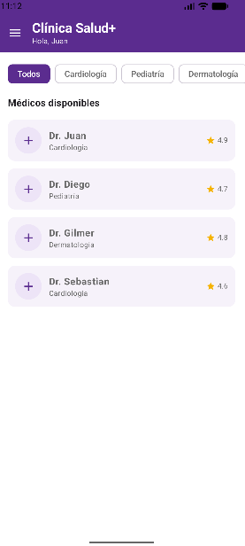
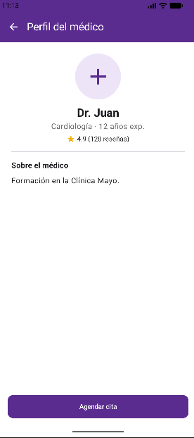
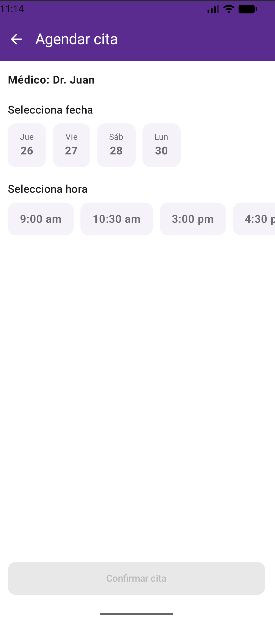
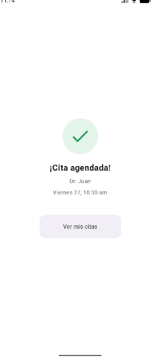
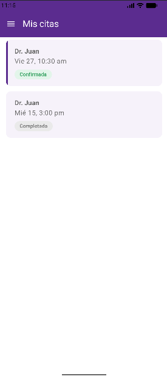
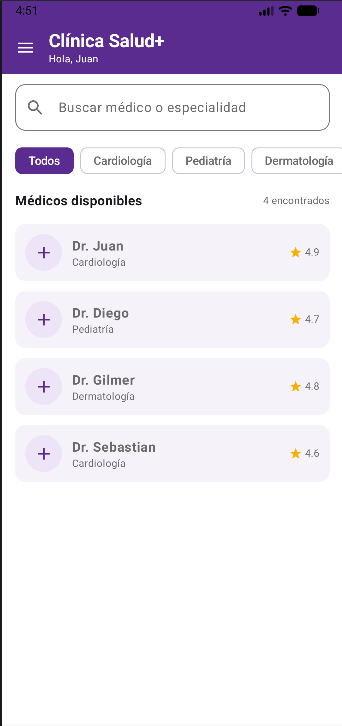
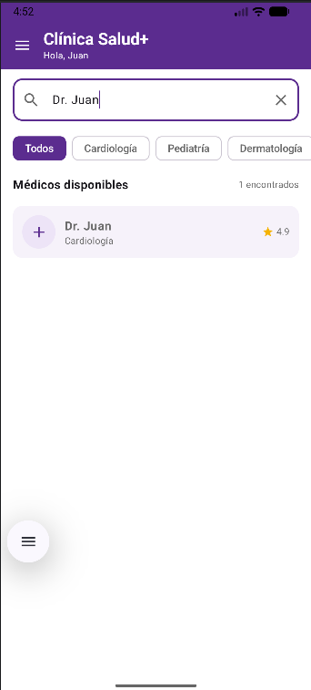

# Clínica Salud+
---
### Requisitos funcionales
* Inicio: LazyRow con chips de especialidad (mínimo 2) y LazyColumn con lista de médicos (mínimo 3), cada tarjeta con nombre, especialidad y calificación.
* Perfil del médico: recibe los datos del médico elegido por parámetro de navegación; botón "Agendar cita".
* Agendar cita: selección de fecha (mínimo 3 opciones) y hora (mínimo 3 opciones), ambas de selección única.
* Confirmación: resumen de la cita agendada (médico, fecha, hora); botón para volver al inicio.
* Menú lateral (drawer): ícono ☰ en la topBar de Inicio; mínimo 3 destinos (Inicio, Mis citas, Historial médico).
* Mis citas: LazyColumn con las citas agendadas, cada una con su estado (Confirmada / Completada) diferenciado visualmente.
---
### Resultados
  
   

### Mejoras IA
 