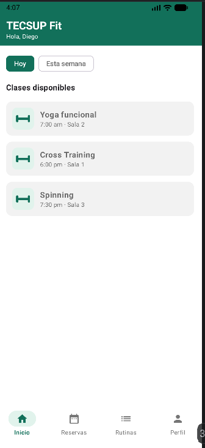
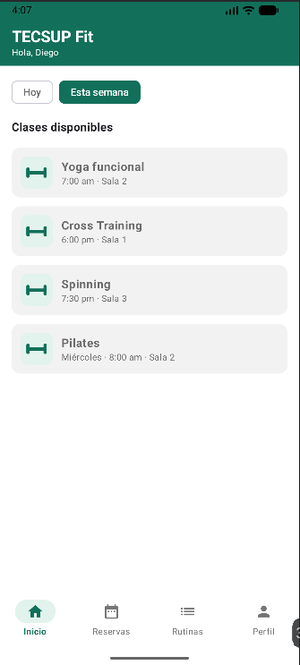
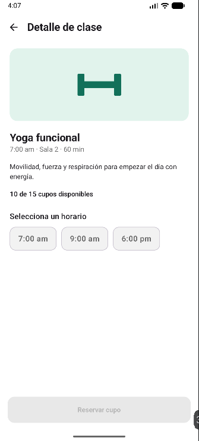
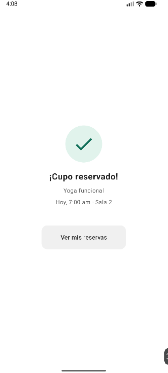
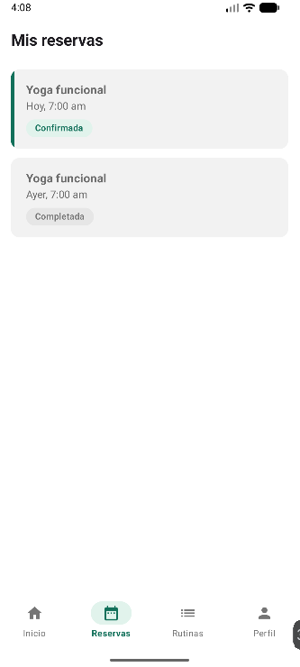
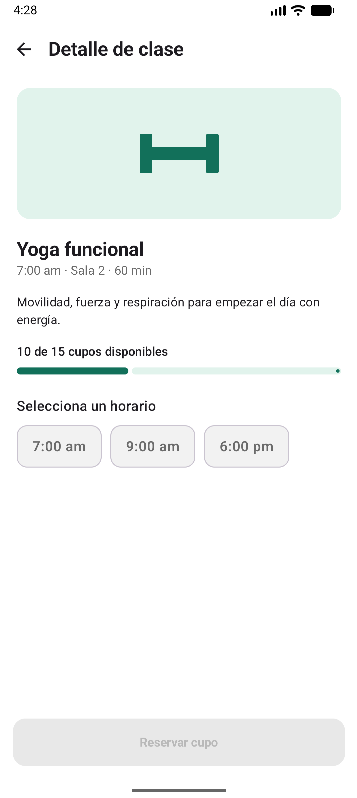
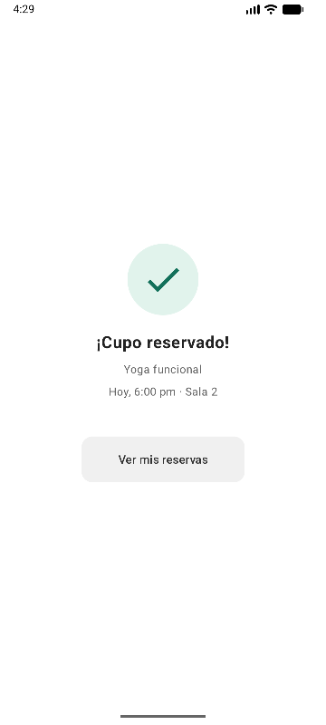
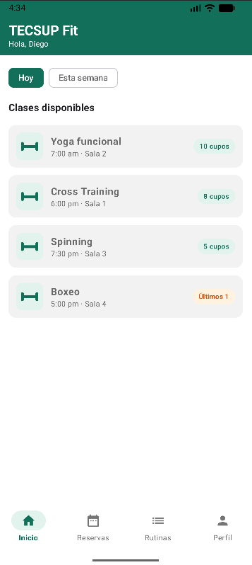

### Requisitos funcionales — Opción B
* Inicio: LazyRow con chips de filtro (mínimo 2: "Hoy" / "Esta semana") y LazyColumn con lista de clases (mínimo 3), cada tarjeta con nombre y horario.
* Detalle de clase: recibe los datos de la clase elegida por parámetro de navegación; botón "Reservar cupo".
* Confirmación: resumen de la reserva (clase, horario); botón para ver reservas.
* bottomBar: visible en Inicio, Reservas y Perfil, con 4 pestañas (Inicio, Reservas, Rutinas, Perfil); el ícono activo se resalta según la pantalla actual.
* Reservas: LazyColumn con las clases reservadas, cada una con su estado (Confirmada / Completada) diferenciado visualmente.
* Perfil: datos del usuario y estadísticas simples (ej. clases tomadas, racha de asistencia).

---

Resultados:
  
 

### MEJORAS CON IA
  
