# Clínica SaludPlus · App Paciente
###### Gutierrez Duran Juan Diego Gilmer
App Android hecha con Kotlin y Jetpack Compose (Material 3) para agendar citas médicas en la Clínica SaludPlus.  
El paciente se registra, elige especialidad, médico, fecha y hora, y gestiona sus citas, resultados y datos desde un menú inferior.  
No usa base de datos: usuarios, médicos y citas viven en colecciones dentro del objeto `Repositorio` y se pierden al cerrar la app.

## Objetivos

* Completar una app real de agendamiento de citas médicas a partir de un código esqueleto, llenando cada archivo .kt según sus comentarios TODO.
* Implementar NavigationBar como menú principal de navegación en la pantalla de Inicio (Inicio, Citas, Resultados, Perfil).
* Aplicar LazyRow (especialidades destacadas), LazyColumn (especialidades, médicos y citas) y LazyVerticalGrid (horarios) trabajando con colecciones en memoria.
* Aplicar navegación con paso de parámetros (especialidadId, medicoId, fecha, hora) y popUpTo.
* Diseñar las vistas que faltan en el diseño de referencia respetando su estilo visual.
* Aplicar control de versiones con GitHub en dos fases: desarrollo propio y mejora asistida por IA.

## Esqueleto del proyecto

```text
com.gutierrez.citas
├── MainActivity.kt
├── data
│   ├── model
│   │   ├── Usuario.kt
│   │   ├── Especialidad.kt
│   │   ├── Medico.kt
│   │   ├── Cita.kt
│   │   └── Resultado.kt
│   └── repository
│       └── Repositorio.kt
├── navigation
│   ├── Rutas.kt
│   └── AppNavigation.kt
├── util
│   └── FechaTexto.kt
└── ui
    ├── theme
    │   ├── Color.kt
    │   ├── Theme.kt
    │   └── Type.kt
    ├── components
    │   ├── BannerDegradado.kt
    │   ├── BarraInferior.kt
    │   ├── BarraSuperior.kt
    │   ├── BotonPrimario.kt
    │   ├── CampoConIcono.kt
    │   ├── Componentes.kt
    │   ├── EnlaceTexto.kt
    │   ├── FilaDato.kt
    │   ├── FotoMedico.kt
    │   ├── IconoEspecialidad.kt
    │   ├── PantallaEnConstruccion.kt
    │   ├── TarjetaBase.kt
    │   └── TarjetaMedico.kt
    └── screens
        ├── auth
        │   ├── SplashScreen.kt
        │   ├── RegistroScreen.kt
        │   ├── LoginScreen.kt
        │   └── TerminosScreen.kt
        ├── home
        │   └── HomeScreen.kt
        ├── agendamiento
        │   ├── EspecialidadesScreen.kt
        │   ├── MedicosScreen.kt
        │   ├── FechaHoraScreen.kt
        │   ├── ConfirmarCitaScreen.kt
        │   └── CitaExitosaScreen.kt
        ├── citas
        │   ├── MisCitasScreen.kt
        │   └── DetalleCitaScreen.kt
        ├── perfil
        │   └── PerfilScreen.kt
        ├── resultados
        │   └── ResultadosScreen.kt
        └── notificaciones
            └── NotificacionesScreen.kt
```

## Capturas

| Splash                                                 | Registro                                                   | Iniciar sesión                                                     |
|--------------------------------------------------------|------------------------------------------------------------|--------------------------------------------------------------------|
|  | 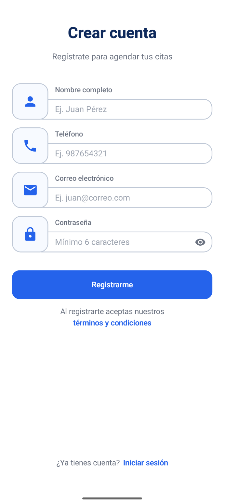 | 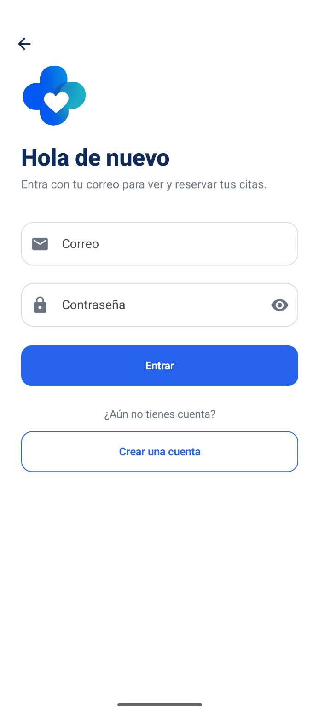 |

| Inicio                                                      | Especialidades                                                    | Médicos                                              |
|-------------------------------------------------------------|-------------------------------------------------------------------|------------------------------------------------------|
| 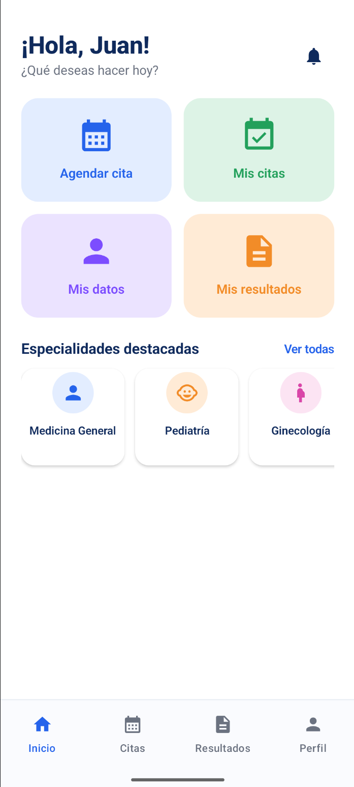 | 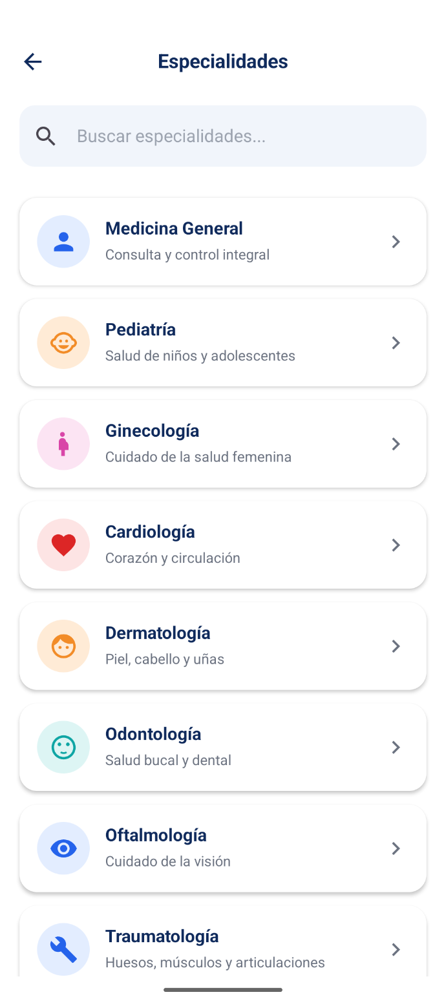 | 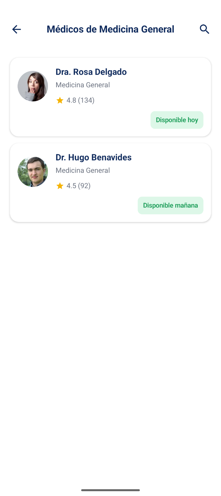 |

| Fecha y hora                                                 | Confirmar cita                                                     | Cita agendada                                                    |
|--------------------------------------------------------------|--------------------------------------------------------------------|------------------------------------------------------------------|
| 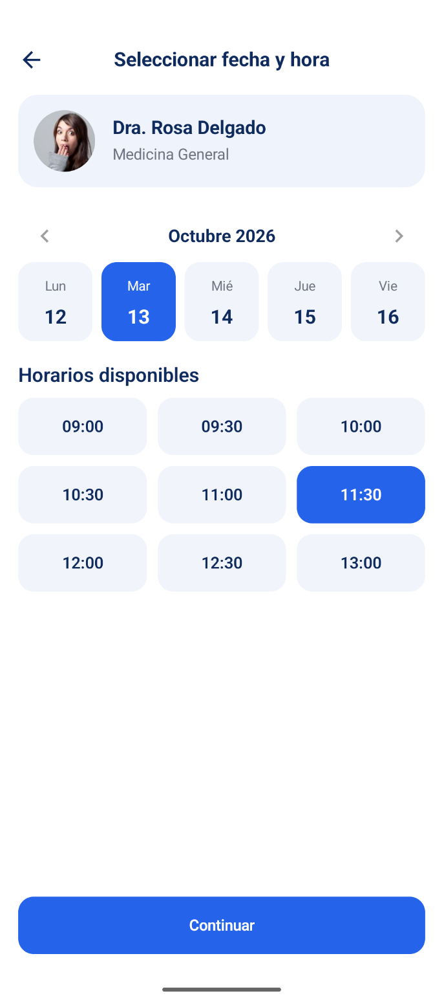 | 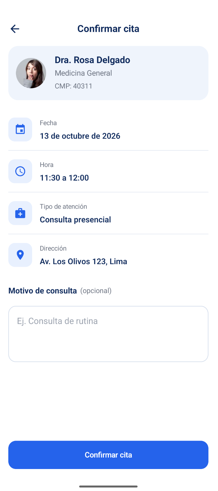 | 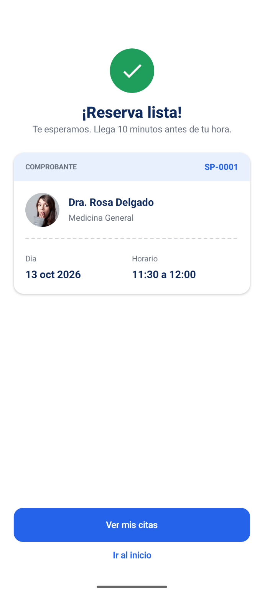 |

| Mis citas                                                          | Mis citas (sin citas)                                                          | Detalle de cita                                                   |
|--------------------------------------------------------------------|--------------------------------------------------------------------------------|-------------------------------------------------------------------|
| 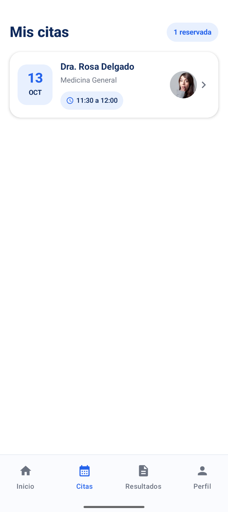 | 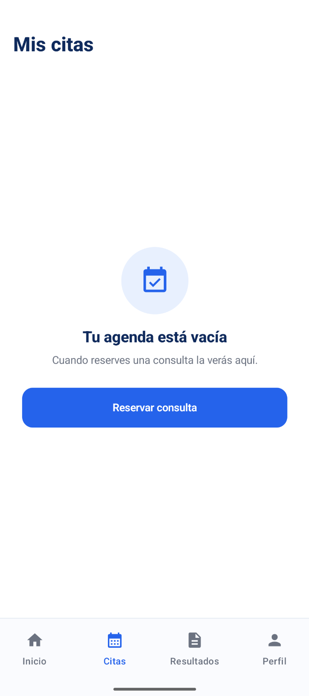 | 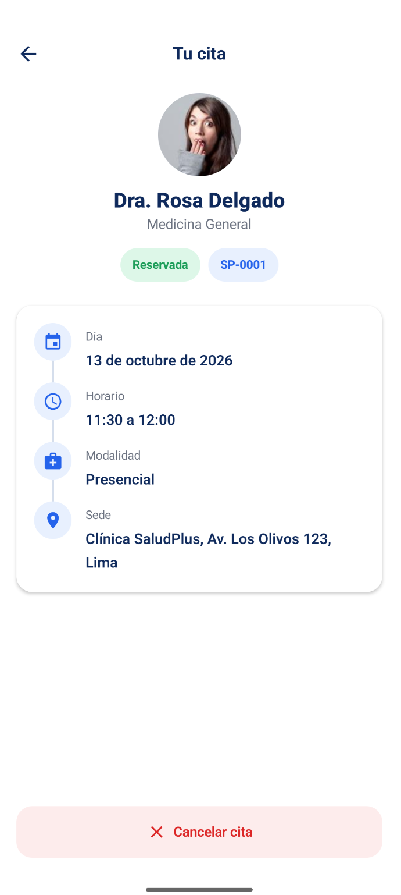 |

| Cancelar cita (diálogo)                                                    | Perfil / Mis datos                                                     | Resultados                                                   |
|----------------------------------------------------------------------------|------------------------------------------------------------------------|--------------------------------------------------------------|
| 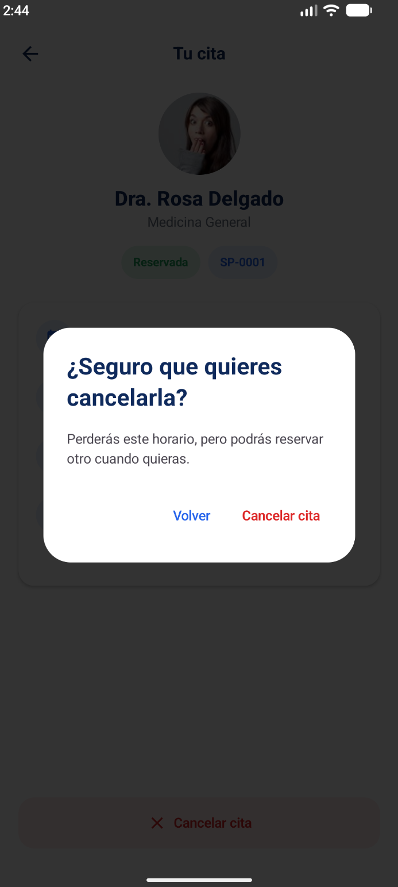 | 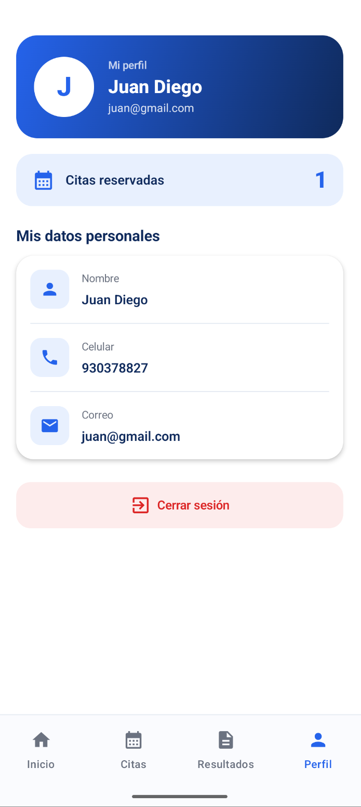 |  |

| Notificaciones                                                      | Notificaciones (vacío)                                                            | Términos y condiciones                                                           |
|---------------------------------------------------------------------|-----------------------------------------------------------------------------------|----------------------------------------------------------------------------------|
| 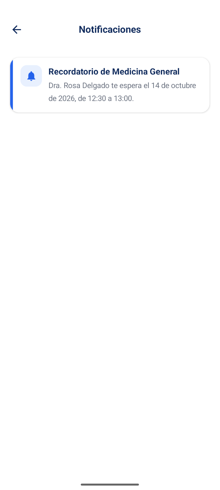 | 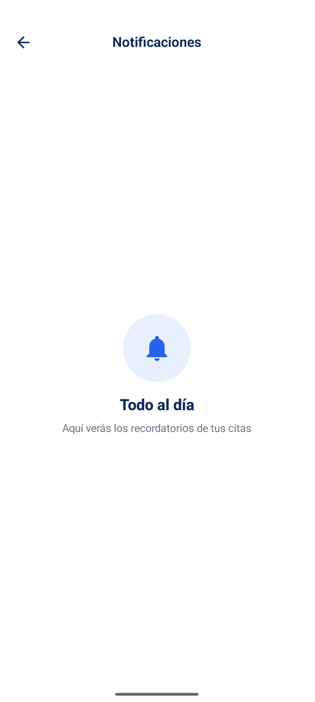 | 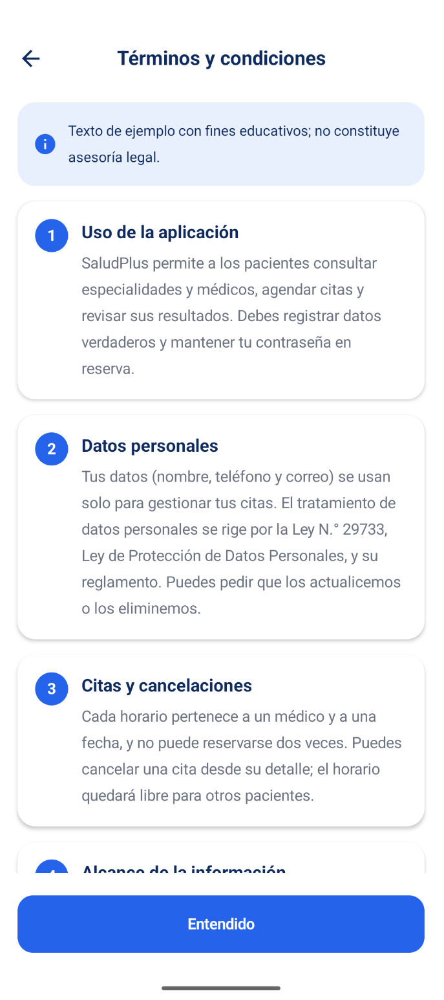 |

---
## FASE 2: CON-IA
### Prompt N°1:
ROL
Actúa como un desarrollador Android senior experto en Kotlin, Jetpack Compose y el paquete java.time.

CONTEXTO
Tengo una app llamada Clínica SaludPlus (Kotlin, Jetpack Compose, Material 3, paquete
com.gutierrez.citas, sin base de datos). Las fechas de las citas se guardan como String con formato
"yyyy-MM-dd" (por ejemplo "2026-10-12"). Hoy la pantalla Fecha y hora muestra una lista fija de días y
quiero reemplazarla por un calendario dinámico con java.time.LocalDate. En este primer paso solo
necesito las funciones de apoyo. El proyecto ya tiene util/FechaTexto.kt, que no debes modificar.
El minSdk actual es 24.

TAREA
1. Crea el archivo util/FechasEs.kt con estas funciones:
    - proximosDiasHabiles(desde: LocalDate, cantidad: Int = 5): List<LocalDate>
      Devuelve los siguientes `cantidad` días hábiles a partir de `desde` (incluido si es hábil).
    - nombreMesAnio(fecha: LocalDate): String  ->  "Octubre 2026"
    - abreviaturaDia(fecha: LocalDate): String ->  "Lun", "Mar", "Mié", "Jue", "Vie"
    - fechaLargaEs(fechaIso: String): String   ->  "Martes 16 de setiembre 2026"
2. Sube minSdk de 24 a 26 en el build.gradle.kts del módulo app, porque java.time lo requiere.

RESTRICCIONES
- Sin librerías externas y sin depender del Locale del sistema: los nombres de meses y días van en
  listas propias en español.
- Los sábados y domingos nunca deben aparecer en proximosDiasHabiles.
- El mes lleva mayúscula inicial en nombreMesAnio; en fechaLargaEs el día de la semana lleva
  mayúscula inicial, el mes va en minúscula, se escribe "setiembre" (con t) y no hay "de" antes del año.
- Si fechaLargaEs recibe un texto que no se puede convertir a fecha, lo devuelve tal cual.
- No cambies ningún otro archivo.

FORMATO DE RESPUESTA
Aplica los cambios directamente en los archivos del proyecto (crea util/FechasEs.kt y edita
app/build.gradle.kts); no me pegues el código en el chat. Al terminar, dime en máximo 5 líneas qué
archivos creaste o modificaste y qué hace cada función.